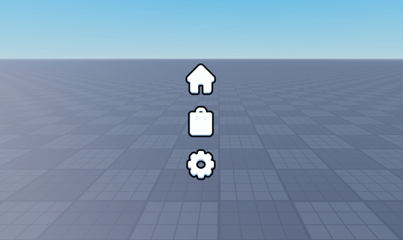

# 🌈 Roblox UI Framework

A simple UI Framework for Roblox Games ✨

---

## 🚀 Features

- ✨ Hover Animations  
- 🎨 Button Effects  
- 🎛️ Notifications *(Coming Soon)*  
- ⚡ Smooth Transitions (Tween-based)  
- 🧩 Easy Applyable  
- 📦 Lightweight & Performance Friendly  

---

## 🎥 Preview

- https://www.roblox.com/games/87658331850553/UI-Framework-Public-Test

---

## 📦 Installation

1. Install the **latest** version: https://github.com/kirayykiray/ui-framework/releases/tag/Update
2. **Right Click** on **Workspace** and select **Insert** and then **Insert from file**. Now, select the downloaded file.
3. **Ungroup Everything** in the correct directories.
4. Now add **any Button** to your liking to the extracted **ScreenGui**, set the *AnchorPoint** to **`0.5, 0.5`**

> [!TIP]
> Scroll down to the **Tags**, and add available presets:
> 
> "Sparkle" ✨  
> "Explosion" 💥  
> "Confetti" 🎉 
> "Glitch" 🌀  
> "Shatter" 🧩  

---

## 🙏 Credits

Special thanks to:

- 🧠 **Stewiepfing** – For inspiration and Code Snippets  
- 🤖 **AI** – For helping me develop the System  

---

Made with 💖 by [kirayykiray](https://github.com/kirayykiray)
